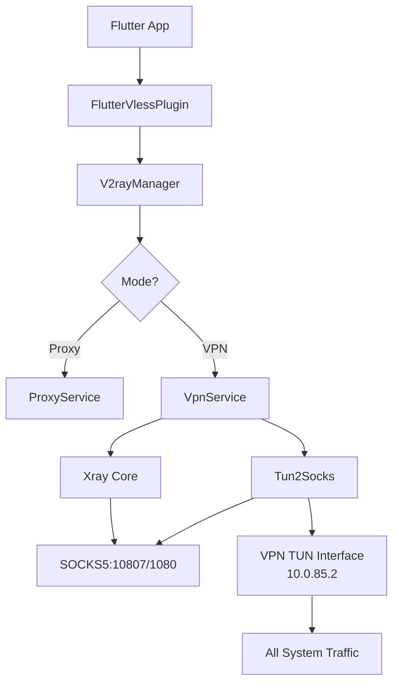

### Core Components



### Xray Internal Routing Rules


| Priority | Rule | Outbound | Purpose |
|----------|------|----------|---------|
| 1 | `inboundTag: api` | `api` | Internal API queries (no network) |
| 2 | `domain/ip: <vpn-server>` | `direct` | Bypass VPN server (prevent loop) |
| 3 | `ip: 8.8.8.8, 1.1.1.1` | `direct` | Bypass DNS servers |
| 4 | `network: tcp,udp` | `proxy` | All other traffic through VPN |

### Windows OS Routes

```powershell
# Default route (all traffic → TUN)
netsh interface ip add route 0.0.0.0/0 "flutter_vless_tun" 10.0.85.1 metric=1

# Bypass routes (higher priority due to /32 specificity)
route ADD <vpn-server-ip> MASK 255.255.255.255 <physical-gateway> METRIC 1
route ADD 8.8.8.8 MASK 255.255.255.255 <physical-gateway> METRIC 1
route ADD 1.1.1.1 MASK 255.255.255.255 <physical-gateway> METRIC 1
```
